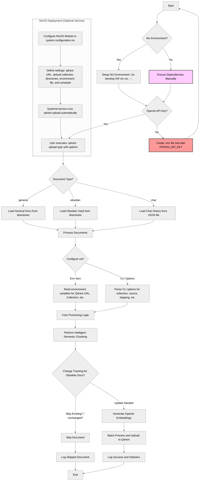

# Qdrant Document Uploader

Upload and index documents to a Qdrant vector database with OpenAI embeddings using Nix for reproducible environments.

## Workflow



## Quick Start

### Using Nix Flakes (Recommended)

```bash
# Development shell with dependencies
nix develop

# Or run directly
nix run . -- obsidian --collection my_knowledge --dirs ~/Documents/Notes
```

### Set Up OpenAI API Key

Create a `.env` file in your working directory:
```
OPENAI_API_KEY=your_openai_api_key_here
```

## Document Types

```bash
# 1. General documents
qdrant-upload general --dirs /path/to/docs --collection general_docs

# 2. Obsidian vault
qdrant-upload obsidian --dirs /path/to/vault --collection obsidian_docs

# 3. Chat history
qdrant-upload chat --json-file /path/to/chat_history.json --collection chat_docs
```

## Key Features

- **Intelligent chunking**: Semantic document splitting preserves context
- **Change tracking**: Avoids reprocessing unchanged documents
- **Batch processing**: Efficiently handles large document collections 
- **Custom embedding**: Uses OpenAI's text-embedding-3-large model

## Configuration

### Environment Variables

| Variable | Default | Description |
|----------|---------|-------------|
| `QDRANT_UPLOAD_URL` | `http://localhost:6333` | Qdrant server URL |
| `QDRANT_UPLOAD_COLLECTION` | `main` | Collection name |
| `QDRANT_UPLOAD_MODEL` | `text-embedding-3-large` | Embedding model |
| `QDRANT_FOLDERS` | `[]` | Default directories to process |

### Command Line Options

```bash
qdrant-upload --help

# Common options
  --collection NAME     Collection name (default: "main")
  --source ID           Custom source identifier
  --skip-existing       Skip documents already in collection
  --force-update        Update all documents regardless of changes
```

## NixOS Module

Add to your NixOS configuration:

```nix
# Import using flake
imports = [(builtins.getFlake "github:Cody-W-Tucker/qdrant-upload").nixosModules.default];

# Configure the service
services.qdrant-upload = {
  enable = true;
  qdrantUrl = "http://localhost:6333";
  defaultCollection = "my_documents";
  obsidianDirectories = ["/home/user/Documents/Notes"];
  
  # API key for OpenAI
  environmentFile = "/path/to/secrets/qdrant-upload.env";
  
  # Optional: Scheduled updates
  enableService = true;
  serviceSchedule = "*-*-* 02:00:00";  # Run daily at 2 AM
};
```

## Advanced Usage

### Processing Multiple Directories

```bash
# Set multiple directories in environment
export QDRANT_FOLDERS="$HOME/Documents/Notes $HOME/Documents/Research"
qdrant-upload obsidian

# Or specify directly
qdrant-upload obsidian --dirs ~/Documents/Notes ~/Documents/Research
```

### Using Custom Nix Development Shell

```bash
# Shell with custom configuration
nix develop .#custom

# With custom arguments
nix develop --arg 'config.qdrantUrl = "http://localhost:6333"'
```

## Troubleshooting

- **Authentication errors**: Check your OpenAI API key in `.env`
- **Connection issues**: Verify Qdrant server is running at specified URL
- **Embedding failures**: Ensure documents have sufficient content length
- **Missing dependencies**: Use the Nix development shell for a complete environment

## Structure

This project includes:

- Custom LangChain extensions (langchain-experimental v0.3.1, langchain-qdrant v0.2.0)
- Development environments with all dependencies
- NixOS module for system integration
- Command-line wrappers for simplified usage 