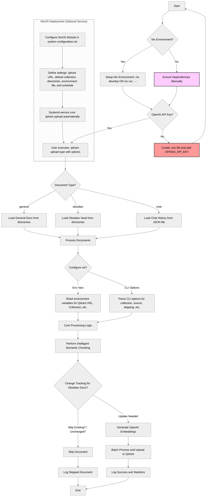

# Qdrant Document Uploader

Upload and index documents to a Qdrant vector database with OpenAI embeddings using Nix for reproducible environments.

## Workflow



## Quick Start

### Using Nix Flakes (Recommended)

```bash
# Development shell with dependencies
nix develop

# Or run directly
nix run . -- obsidian --collection my_knowledge --dirs ~/Documents/Notes
```

### Set Up Ollama

1. **Install Ollama** (if not already installed):
   ```bash
   # On macOS/Linux
   curl -fsSL https://ollama.ai/install.sh | sh
   
   # Or visit https://ollama.ai for other installation methods
   ```

2. **Pull the embedding model**:
   ```bash
   ollama pull nomic-embed-text
   ```

3. **Start Ollama** (if not running):
   ```bash
   ollama serve
   ```

The default configuration connects to Ollama at `http://localhost:11434`. If your Ollama instance runs elsewhere, create a `.env` file:

```
OLLAMA_URL=http://your-ollama-server:11434
```

## Document Types

```bash
# 1. General documents
qdrant-upload general --dirs /path/to/docs --collection general_docs

# 2. Obsidian vault
qdrant-upload obsidian --dirs /path/to/vault --collection obsidian_docs

# 3. Chat history (with message pairing by default)
qdrant-upload chat --json-file /path/to/chat_history.json --collection chat_docs

# 3a. Chat history with individual message processing (legacy mode)
qdrant-upload chat --json-file /path/to/chat_history.json --collection chat_docs --individual-messages
```

## Key Features

-   **Intelligent chunking**: Semantic document splitting preserves context
-   **Message pairing**: Groups user and AI messages for better chat context (default for chat documents)
-   **Change tracking**: Avoids reprocessing unchanged documents
-   **Batch processing**: Efficiently handles large document collections
-   **Local embeddings**: Uses Ollama's nomic-embed-text model running locally

## Chat Document Processing

By default, chat documents are processed using **message pairing**, which groups user questions with their corresponding AI responses into single documents. This provides better context for vector search as related conversational exchanges are kept together.

### Message Pairing (Default)
```bash
# Groups "User: question" + "Assistant: response" into single documents
qdrant-upload chat --json-file chat.json --collection chat_history
```

### Individual Messages (Legacy)
```bash
# Processes each message separately (original behavior)
qdrant-upload chat --json-file chat.json --collection chat_docs --individual-messages
```

**Benefits of Message Pairing:**
- Better semantic search results for conversational content
- Maintains question-answer context
- Reduces fragmented responses in search results
- More meaningful embeddings for chat interactions

## Configuration

### Environment Variables

| Variable                   | Default                    | Description                    |
| -------------------------- | -------------------------- | ------------------------------ |
| `QDRANT_UPLOAD_URL`        | `http://localhost:6333`   | Qdrant server URL              |
| `QDRANT_UPLOAD_COLLECTION` | `inbox`                   | Collection name                |
| `QDRANT_UPLOAD_MODEL`      | `nomic-embed-text:latest` | Ollama embedding model         |
| `QDRANT_UPLOAD_BATCH_SIZE` | `500`                     | Batch size for processing      |
| `OLLAMA_URL`               | `http://localhost:11434`  | Ollama server URL              |
| `QDRANT_FOLDERS`           | `[]`                      | Default directories to process |

### Command Line Options

```bash
qdrant-upload --help

# Common options
  --collection NAME         Collection name (default: "personal")
  --source ID               Custom source identifier
  --skip-existing           Skip documents already in collection
  --force-update            Update all documents regardless of changes

# Chat-specific options
  --pair-messages           Group user and assistant messages into pairs (default: True)
  --individual-messages     Process each message individually (overrides --pair-messages)
```

## NixOS Module

Add to your NixOS configuration:

```nix
# Import using flake
imports = [(builtins.getFlake "github:Cody-W-Tucker/qdrant-upload").nixosModules.default];

# Configure the service
services.qdrant-upload = {
  enable = true;
  qdrantUrl = "http://localhost:6333";
  defaultCollection = "my_documents";
  obsidianDirectories = ["/home/user/Documents/Notes"];

  # API key for OpenAI
  environmentFile = "/path/to/secrets/qdrant-upload.env";

  # Optional: Scheduled updates
  enableService = true;
  serviceSchedule = "*-*-* 02:00:00";  # Run daily at 2 AM
};
```

## Advanced Usage

### Processing Multiple Directories

```bash
# Set multiple directories in environment
export QDRANT_FOLDERS="$HOME/Documents/Notes $HOME/Documents/Research"
qdrant-upload obsidian

# Or specify directly
qdrant-upload obsidian --dirs ~/Documents/Notes ~/Documents/Research
```

### Using Custom Nix Development Shell

```bash
# Shell with custom configuration
nix develop .#custom

# With custom arguments
nix develop --arg 'config.qdrantUrl = "http://localhost:6333"'
```

## Troubleshooting

-   **Authentication errors**: Check your OpenAI API key in `.env`
-   **Connection issues**: Verify Qdrant server is running at specified URL
-   **Embedding failures**: Ensure documents have sufficient content length
-   **Missing dependencies**: Use the Nix development shell for a complete environment

## Structure

This project includes:

-   Custom LangChain extensions (langchain-experimental v0.3.1, langchain-qdrant v0.2.0)
-   Development environments with all dependencies
-   NixOS module for system integration
-   Command-line wrappers for simplified usage
