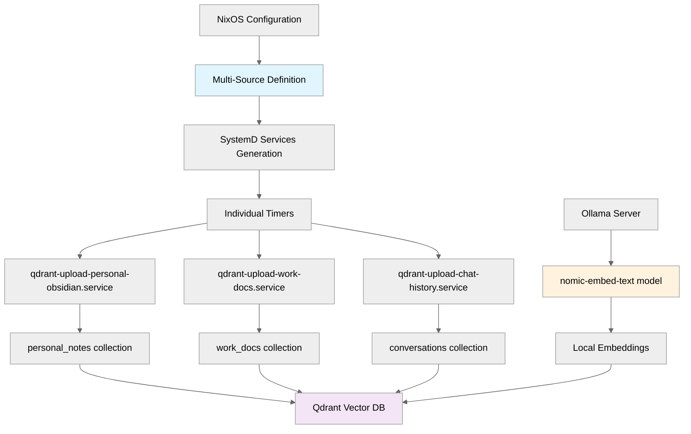

# Qdrant Document Uploader

A powerful document processing and indexing service for Qdrant vector databases using Ollama embeddings. Supports multiple document sources, each with their own collections, and provides high-performance async processing optimized for local LLM setups.

## ✨ Key Features

- **Multi-Source Configuration**: Process multiple document locations into separate collections
- **Smart Document Types**: Obsidian vaults, general documents, and chat conversations
- **High-Performance Processing**: Async processing with GPU optimization (3-5x faster)
- **Code-Aware Splitting**: Preserves code blocks intact during text chunking  
- **Change Tracking**: Skip unchanged documents for faster incremental updates
- **NixOS Integration**: Full SystemD service management with individual timers
- **Local Embeddings**: Uses Ollama's nomic-embed-text model (no API keys needed)

## 🚀 Quick Start

### Installation (Recommended: NixOS Flake)

Add to your NixOS flake inputs:

```nix
{
  inputs = {
    # ... your existing inputs
    qdrant-upload = {
      url = "github:Cody-W-Tucker/Qdrant-Upload";
      inputs.nixpkgs.follows = "nixpkgs";
    };
  };

  outputs = inputs@{ qdrant-upload, ... }: {
    nixosConfigurations.your-host = nixpkgs.lib.nixosSystem {
      modules = [
        # Add the module
        qdrant-upload.nixosModules.default
        # ... your other modules
      ];
    };
  };
}
```

### Configuration

Configure multiple sources in your NixOS host file:

```nix
services.qdrant-upload = {
  enable = true;
  enableService = true;

  # Global settings
  qdrantUrl = "http://localhost:6333";
  embeddingModel = "nomic-embed-text:latest";
  
  # Performance settings (RTX 3070 optimized)
  batchSize = 2000;
  maxConcurrent = 4;
  asyncChat = true;
  
  # Multiple sources - each gets its own collection
  sources = [
    # Personal Obsidian vault
    {
      name = "personal-obsidian";
      type = "obsidian";
      collection = "personal_notes";
      directories = [ "/home/user/Documents/PersonalVault" ];
    }
    
    # Work documents
    {
      name = "work-docs";
      type = "general";
      collection = "work_docs";
      directories = [ "/home/user/Documents/Work" ];
      schedule = "*-*-* 01:00:00";  # Custom schedule
    }
    
    # Chat conversations
    {
      name = "chat-history";
      type = "chat";
      collection = "conversations";
      jsonFile = "/home/user/Downloads/open-webui-export.json";
      schedule = "*-*-* 04:00:00";
    }
  ];
};
```

### Deploy & Manage

```bash
# Deploy the configuration
sudo nixos-rebuild switch --flake .#your-host

# Check individual services
systemctl status qdrant-upload-personal-obsidian
systemctl status qdrant-upload-work-docs
systemctl status qdrant-upload-chat-history

# View all timers
systemctl list-timers | grep qdrant-upload

# Monitor logs
journalctl -u qdrant-upload-personal-obsidian -f

# Manual execution
sudo -u qdrant-upload qdrant-upload obsidian --collection personal_notes --dirs /home/user/Documents/PersonalVault
```

## 📋 Prerequisites

### 1. Qdrant Server

```bash
# Docker (recommended)
docker run -p 6333:6333 qdrant/qdrant

# Or install locally
# See: https://qdrant.tech/documentation/quick_start/
```

### 2. Ollama with Embedding Model

```bash
# Install Ollama
curl -fsSL https://ollama.ai/install.sh | sh

# Pull embedding model
ollama pull nomic-embed-text

# Start Ollama (if not running)
ollama serve
```

## 🔧 Configuration Reference

### Source Configuration

Each source in the `sources` list supports:

```nix
{
  name = "unique-name";                    # Required: Unique identifier
  type = "obsidian" | "general" | "chat"; # Required: Document type
  collection = "collection_name";          # Required: Qdrant collection
  
  # For obsidian/general types:
  directories = [ "/path/to/docs" ];       # Required: List of directories
  
  # For chat type:
  jsonFile = "/path/to/export.json";      # Required: Open-WebUI export file
  
  # Optional settings:
  customSource = "source-identifier";     # Custom source tag for documents
  skipExisting = false;                    # Skip documents that already exist
  forceUpdate = false;                     # Force update all documents
  schedule = "*-*-* 02:00:00";            # Custom schedule (systemd timer format)
}
```

### Global Settings

```nix
services.qdrant-upload = {
  # Connection settings
  qdrantUrl = "http://localhost:6333";
  embeddingModel = "nomic-embed-text:latest";
  vectorDimensions = 768;
  distanceMetric = "Cosine";
  
  # Performance settings
  batchSize = 2000;              # GPU-optimized batch size
  maxConcurrent = 4;             # Concurrent processing batches  
  asyncChat = true;              # Enable async chat processing
  chunkSize = 2500;              # Text chunk size
  chunkOverlap = 200;            # Chunk overlap
  semanticChunker = "auto";      # "true", "false", or "auto" (chat only)
  minContentLength = 50;         # Minimum document length
  
  # Service settings
  user = "qdrant-upload";        # Service user
  group = "qdrant-upload";       # Service group
  defaultSchedule = "*-*-* 02:00:00";  # Default schedule for all sources
  environmentFile = "/etc/qdrant-upload/.env";  # Optional env file
};
```

### Environment Variables

Create `/etc/qdrant-upload/.env` for additional configuration:

```bash
# Ollama configuration
OLLAMA_URL=http://localhost:11434

# Override performance settings if needed
# QDRANT_UPLOAD_BATCH_SIZE=1500
# QDRANT_UPLOAD_MAX_CONCURRENT=3
```

## 📊 Document Processing

### Obsidian Documents
- Processes `.md` files with full metadata preservation
- Handles wikilinks, tags, and frontmatter
- Smart change detection to skip unchanged files
- Header-based chunking for better context

### General Documents  
- Supports multiple file formats (PDF, TXT, MD, etc.)
- Recursive directory processing
- Metadata extraction and preservation
- Configurable content filtering

### Chat Conversations
- **New Approach**: Processes entire conversations as single documents
- Preserves all message formatting and context
- **Code Block Protection**: Keeps ```code blocks``` intact during splitting
- Rich metadata: conversation ID, title, models used, timestamps
- Supports Open-WebUI JSON exports

## 🔍 Advanced Usage

### Development Mode

```bash
# Clone and develop locally
git clone https://github.com/Cody-W-Tucker/Qdrant-Upload
cd Qdrant-Upload

# Enter development shell
nix develop

# Run manually
python upload.py --type obsidian --dirs ~/Documents/Notes --collection test_docs
```

### Local Flake Reference

For local development in your main flake:

```nix
inputs = {
  # Local development
  qdrant-upload.url = "path:../Qdrant-Upload";
  
  # Or git reference
  qdrant-upload.url = "git+file:///path/to/Qdrant-Upload";
};
```

### Performance Tuning

The service is optimized for RTX 3070 (8GB VRAM) by default. Adjust for your hardware:

```nix
services.qdrant-upload = {
  # For smaller GPUs (4GB):
  batchSize = 1000;
  maxConcurrent = 2;
  
  # For larger GPUs (16GB+):
  batchSize = 4000;  
  maxConcurrent = 8;
};
```

### Service Management

```bash
# Individual service control
systemctl start qdrant-upload-personal-obsidian
systemctl stop qdrant-upload-work-docs
systemctl restart qdrant-upload-chat-history

# Enable/disable timers
systemctl enable qdrant-upload-personal-obsidian.timer
systemctl disable qdrant-upload-work-docs.timer

# Check service status and logs
systemctl status qdrant-upload-chat-history
journalctl -u qdrant-upload-personal-obsidian --since "1 hour ago"

# List all qdrant-upload services
systemctl list-units | grep qdrant-upload
```

## 🏗️ Architecture



## 🆚 Migration from Single Collection

If you're upgrading from the legacy single-collection approach:

**Old configuration:**
```nix
services.qdrant-upload = {
  enable = true;
  obsidianDirectories = [ "/home/user/Documents/Notes" ];
  defaultCollection = "personal";
};
```

**New multi-source configuration:**
```nix
services.qdrant-upload = {
  enable = true;
  sources = [
    {
      name = "personal-notes";
      type = "obsidian";
      collection = "personal";  # Same collection name
      directories = [ "/home/user/Documents/Notes" ];
    }
  ];
};
```

The new approach provides much more flexibility while maintaining backward compatibility.

## 🔧 Troubleshooting

### Common Issues

**Service fails to start:**
```bash
# Check service status
systemctl status qdrant-upload-source-name

# View detailed logs
journalctl -u qdrant-upload-source-name -f

# Check configuration
nixos-rebuild dry-build --flake .#your-host
```

**Ollama connection issues:**
```bash
# Test Ollama connectivity
curl http://localhost:11434/api/tags

# Check embedding model
ollama list | grep nomic-embed-text

# Restart Ollama
systemctl restart ollama
```

**Qdrant connection issues:**
```bash
# Test Qdrant connectivity  
curl http://localhost:6333/collections

# Check Qdrant logs
docker logs qdrant_container_name
```

**Performance issues:**
- Reduce `batchSize` for memory constraints
- Decrease `maxConcurrent` for CPU/GPU limitations  
- Set `asyncChat = false` to disable async processing
- Use `skipExisting = true` for faster incremental updates

## 📜 License

MIT License - see LICENSE file for details.

## 🤝 Contributing

1. Fork the repository
2. Create a feature branch
3. Make your changes
4. Test with `nix develop`
5. Submit a pull request

For bugs or feature requests, please open an issue on GitHub.
